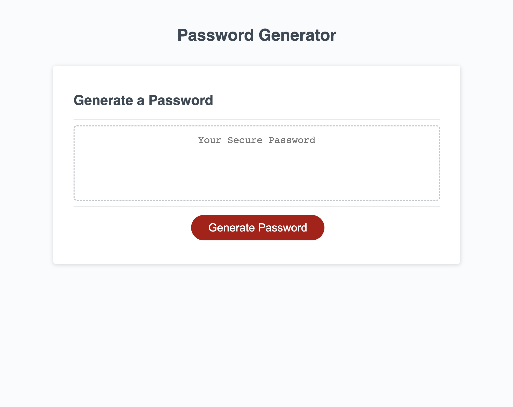

# Password Generator

## Description

The creation of this project is to randomly generate a secure password that meets certain criteria. Passwords can be the only barrier to sensitive information, which means they have to provide greater security than passwords made up of known words that can make it easy for anyone to guess. This password generator will create a quick password based on user preferences in terms of length of password, and whether or not to include lowercase, uppercase, numeric, and/or special characters.

## Installation

Project as a repository on GitHub: https://github.com/renrojas/password-generator

Project deployed on GitHub Pages: 

## Usage

To navigate this webpage please click on the red "Generate Password" button and respond to the instructions and questions it asks you in order to generate your password inside the "Your Secure Password" box.

## Credits

https://www.w3schools.com/jsref/jsref_random.asp - Random Functions

https://masteringjs.io/tutorials/fundamentals/string-concat - Concatenate Strings

https://www.w3schools.com/js/js_loop_for.asp - For Loop

https://www.w3schools.com/js/js_if_else.asp - if, else, else if

https://www.w3schools.com/js/js_loop_while.asp - While Loop

## License

MIT License

Copyright (c) 2023 renrojas

Permission is hereby granted, free of charge, to any person obtaining a copy
of this software and associated documentation files (the "Software"), to deal
in the Software without restriction, including without limitation the rights
to use, copy, modify, merge, publish, distribute, sublicense, and/or sell
copies of the Software, and to permit persons to whom the Software is
furnished to do so, subject to the following conditions:

The above copyright notice and this permission notice shall be included in all
copies or substantial portions of the Software.

THE SOFTWARE IS PROVIDED "AS IS", WITHOUT WARRANTY OF ANY KIND, EXPRESS OR
IMPLIED, INCLUDING BUT NOT LIMITED TO THE WARRANTIES OF MERCHANTABILITY,
FITNESS FOR A PARTICULAR PURPOSE AND NONINFRINGEMENT. IN NO EVENT SHALL THE
AUTHORS OR COPYRIGHT HOLDERS BE LIABLE FOR ANY CLAIM, DAMAGES OR OTHER
LIABILITY, WHETHER IN AN ACTION OF CONTRACT, TORT OR OTHERWISE, ARISING FROM,
OUT OF OR IN CONNECTION WITH THE SOFTWARE OR THE USE OR OTHER DEALINGS IN THE
SOFTWARE.
